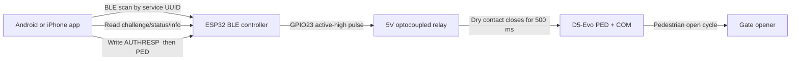

# D5-Evo BLE Pedestrian Trigger

Local-only Bluetooth control for a D5-Evo gate opener. An ESP32 exposes a
small BLE service, validates an optional challenge-response unlock, and pulses
one relay wired across the D5-Evo `PED` and `COM` dry-contact input. The Android
and iPhone apps connect nearby over BLE and send the pedestrian trigger command.

This repository is deliberately narrow. It supports one hardware set and one
gate-control job so the installed behavior stays easy to reason about.

## Supported Hardware

- Zaitronics ESP32 USB-C Wi-Fi/Bluetooth Development Board, 38-pin
- Zaitronics LM2596 buck regulator
- Zaitronics 5V 1-channel optocoupled relay module
- Zaitronics 830 tie-point solderless breadboard for bench testing
- Zaitronics 400 tie-point solderless breadboard for compact prototype testing

The firmware assumes:

- relay control on ESP32 `GPIO23`
- active-high relay input by default
- momentary relay pulse across D5-Evo `PED` and `COM`
- no gate-position sensing
- no D5-Evo `Status` input
- no `FRX` wiring
- no alternate ESP32 board profiles

## Repository Map

| Path | Purpose |
| --- | --- |
| `src/main.cpp` | ESP32 Arduino firmware: BLE service, auth protocol, relay timing, status updates. |
| `include/app_config.h` | Shared firmware defaults and BLE UUIDs. |
| `include/app_config_local.example.h` | Local firmware secret/config template. Copy to ignored `app_config_local.h`. |
| `platformio.ini` | PlatformIO build profile for the 38-pin ESP32 board. |
| `android-app/` | Native Android BLE app using Kotlin, AndroidX, and Material components. |
| `ios-app/` | Native iPhone BLE app using SwiftUI, CoreBluetooth, and CryptoKit. |
| `docs/architecture.md` | Human-readable architecture, protocol, and flow diagrams. |
| `AGENTS.md` | Agent-oriented project guide and invariants. |
| `CLAUDE.md` | Claude-oriented project guide mirroring the agent expectations. |

## System Overview



The ESP32 is the authority for physical behavior. Mobile apps never time the
relay directly; they only authenticate and write commands. The firmware enforces
the pulse duration, cooldown, and auth lockout.

More diagrams are in [`docs/architecture.md`](docs/architecture.md).

## Wiring

### Bench Wiring

Use the 830-point breadboard for first bring-up.

Power:

- LM2596 `OUT+` -> ESP32 `5V`
- LM2596 `OUT-` -> ESP32 `GND`
- LM2596 `OUT+` -> relay `DC+` or `VCC`
- LM2596 `OUT-` -> relay `DC-` or `GND`

Relay control:

- ESP32 `GPIO23` -> relay `IN`

Bench-test rule:

- Do not connect relay `COM` and `NO` to the D5-Evo during first relay tests.
- At idle, relay `COM` to `NO` must be open.
- A successful phone trigger should close `COM` to `NO` for about `500 ms`.

### Final D5-Evo Connection

Gate power to buck converter:

- D5-Evo `Aux 12V Out` -> LM2596 `VIN+`
- D5-Evo `COM` -> LM2596 `VIN-`

Relay dry contact:

- relay `COM` -> D5-Evo `COM`
- relay `NO` -> D5-Evo `PED`

Important installation constraints:

- Set the LM2596 output to `5.0V` before connecting the ESP32 or relay.
- Keep the relay output momentary, not latched.
- Leave existing D5-Evo safety wiring untouched.
- Do not treat the breadboard as the final installed gate controller assembly.

## Firmware Behavior

The ESP32 firmware:

- advertises as `D5-EVO-Gate` by default
- exposes one BLE service with command, status, challenge, info, and auth status characteristics
- accepts `AUTHRESP <hex>` and `PED`
- also accepts legacy `TRIGGER` in firmware, though the current apps send `PED`
- pulses the relay for `500 ms`
- enforces a `5 second` cooldown
- rotates the auth challenge after every auth attempt and on connect/disconnect
- locks auth retries for `15 seconds` after a failed response
- disconnects an idle BLE client after `60 seconds` so a locked or closed phone does not reserve the controller indefinitely
- publishes controller and auth status over BLE notifications where supported

Controller status values:

- `ready`
- `pulsing`
- `cooldown`
- `busy`
- `locked`
- `bad-command`

Auth status values:

- `disabled`
- `required`
- `authorized`
- `denied`

## BLE Protocol

Service UUID:

- `4b8c2ec4-3f66-4f00-8a43-95f79d2c0cc1`

Characteristics:

| Characteristic | UUID | Properties | Meaning |
| --- | --- | --- | --- |
| Command | `4b8c2ec4-3f66-4f00-8a43-95f79d2c0cc2` | Write | Accepts `AUTHRESP <hex>` and `PED`. |
| Controller status | `4b8c2ec4-3f66-4f00-8a43-95f79d2c0cc3` | Read, Notify | Firmware relay/control state. |
| Auth challenge | `4b8c2ec4-3f66-4f00-8a43-95f79d2c0cc4` | Read | Current 16-byte challenge encoded as 32 uppercase hex chars, or `disabled`. |
| Info | `4b8c2ec4-3f66-4f00-8a43-95f79d2c0cc5` | Read | Human-readable next-step hint. |
| Auth status | `4b8c2ec4-3f66-4f00-8a43-95f79d2c0cc6` | Read, Notify | Auth session state. |

Auth response algorithm:

1. Read the challenge.
2. Normalize it to uppercase.
3. Compute `SHA-256("D5-EVO-AUTH-V1|" + pin + challenge)`.
4. Repeat 2047 additional rounds of `SHA-256(previous_digest + pin + challenge)`.
5. Hex-encode the 32-byte digest as uppercase.
6. Write `AUTHRESP <hex>`.
7. If auth status becomes `authorized`, write `PED`.

The raw PIN or passphrase is never sent over BLE. The apps keep the passphrase
only in memory while the app process is open, unless a local build-time secret
file is deliberately created for convenience.

## Firmware Setup

1. Install PlatformIO.
2. Copy `include/app_config_local.example.h` to `include/app_config_local.h`.
3. Set `D5_EVO_AUTH_PIN` to a strong passphrase before live gate use.
4. Optionally change `D5_EVO_DEVICE_NAME`.
5. Change `D5_EVO_RELAY_ACTIVE_LEVEL` only if the relay energizes at idle or `COM` to `NO` is closed at idle.
6. Optionally change `D5_EVO_BLE_CLIENT_IDLE_TIMEOUT_MS`; keep it finite so a stale phone connection can be released.
7. Connect the ESP32 by USB-C.
8. Build with `pio run -e esp32-usb-c-38pin`.
9. Upload with `pio run -e esp32-usb-c-38pin -t upload --upload-port /dev/cu.usbserial-XXXX`.
10. Monitor with `pio device monitor -p /dev/cu.usbserial-XXXX -b 115200`.

This ESP32 board uses a CP2102 USB-to-UART bridge. On macOS the upload port is
usually a `/dev/cu.usbserial-*` device.

## Android App

The Android app is in [`android-app`](android-app).

It scans for the custom service UUID, connects with `BluetoothGatt`, resolves
the five characteristics, reads status in a queued operation flow, signs the
challenge locally with `MessageDigest`, writes `PED`, and disconnects when the
activity is no longer visible.

Build steps:

1. Open `android-app` in Android Studio.
2. Copy `android-app/gate.local.properties.example` to ignored `android-app/gate.local.properties` if you want auto-auth in local builds.
3. Set `gate.auth.pin` to the same passphrase used by firmware.
4. Let Gradle sync.
5. Install on an Android phone with BLE.
6. Connect and trigger.

Command-line build:

```bash
cd android-app
./gradlew assembleDebug
```

More Android details are in [`android-app/README.md`](android-app/README.md).

## iPhone App

The iPhone app is in [`ios-app`](ios-app).

It scans with CoreBluetooth for the same custom service UUID, discovers the five
characteristics, enables notifications for status, signs the challenge locally
with CryptoKit, writes `PED`, and disconnects when the app scene leaves the
active foreground.

Build steps:

1. Open `ios-app/D5EvoBleGate.xcodeproj` in Xcode.
2. Copy `ios-app/D5EvoBleGate/Config/LocalSecrets.example.xcconfig` to ignored `LocalSecrets.xcconfig` if you want auto-auth in local builds.
3. Set `D5EVO_AUTH_PIN` to the same passphrase used by firmware.
4. Select an Apple development team for signing before installing on a real iPhone.
5. Build and run.
6. Connect and trigger.

More iOS details are in [`ios-app/README.md`](ios-app/README.md).

## Bench Test Flow

Do this before any connection to the D5-Evo:

1. Put the ESP32, LM2596, and relay module on the 830-point breadboard.
2. Set the LM2596 output to `5.0V`.
3. Power the ESP32 and relay from the LM2596 output.
4. Flash the ESP32 firmware.
5. Open the Android or iPhone app.
6. Connect to the BLE device.
7. If auth is enabled, use the same passphrase in firmware and app.
8. Tap the pedestrian button and let the app authenticate first.
9. Confirm one clean relay click.
10. Confirm an immediate second press shows cooldown behavior.

Only after that passes should relay `COM` and `NO` be connected to D5-Evo
`COM` and `PED`.

## Development Checks

Use the smallest relevant check for the subsystem you touched:

```bash
pio run -e esp32-usb-c-38pin
cd android-app && ./gradlew assembleDebug
xcodebuild -project ios-app/D5EvoBleGate.xcodeproj -scheme D5EvoBleGate -sdk iphonesimulator -configuration Debug build
```

Hardware behavior still needs a bench relay test and, later, a supervised gate
test. A successful app build does not prove the relay wiring or D5-Evo behavior.

## Secrets And Ignored Files

Keep real passphrases out of git. These local files are ignored:

- `include/app_config_local.h`
- `android-app/gate.local.properties`
- `android-app/local.properties`
- `ios-app/D5EvoBleGate/Config/LocalSecrets.xcconfig`

## Removed Scope

Older generic gate-controller paths are intentionally absent:

- alternate `LOLIN32` target
- gate-input/status sensing support
- `FRX` wiring instructions
- generic multi-board instructions
- open/close aliases in the mobile apps
