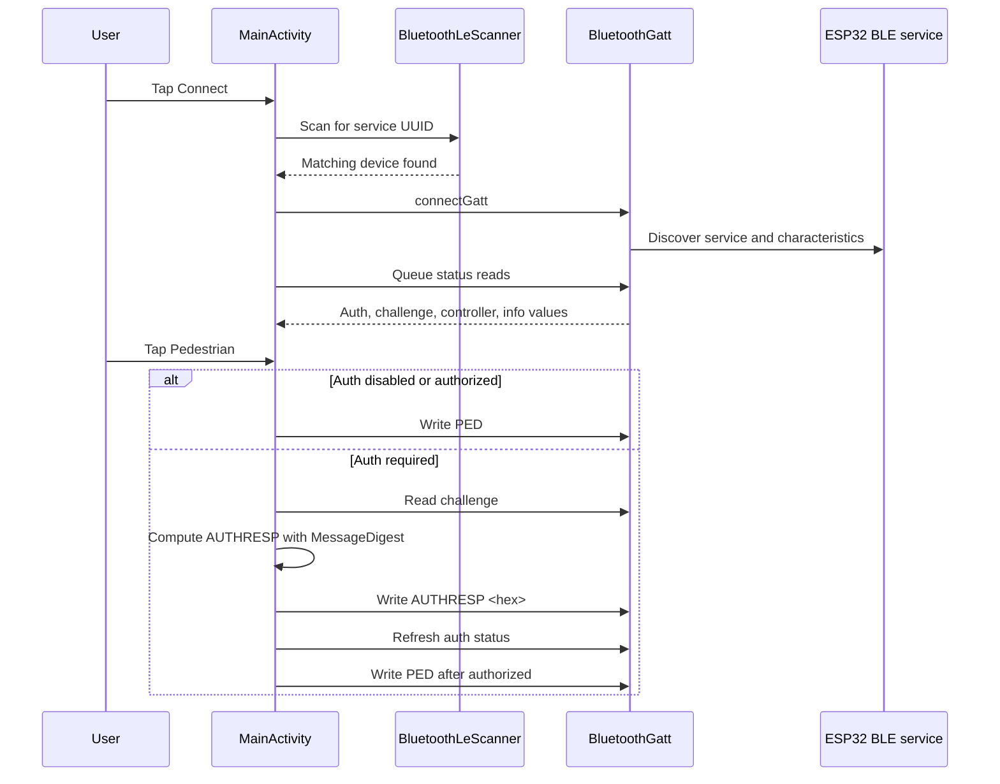

# Android App

Native Android client for the D5-Evo BLE Pedestrian Trigger. The app scans for
the ESP32's custom BLE service, connects locally, reads controller/auth state,
signs the auth challenge when configured, and writes `PED`.

## Stack

- Kotlin activity
- AndroidX AppCompat and Core KTX
- Material Components
- Android BLE APIs: `BluetoothLeScanner`, `BluetoothGatt`, `BluetoothGattCallback`
- Gradle Kotlin DSL
- Minimum SDK 26, target SDK 34, compile SDK 34

## Main Files

| Path | Purpose |
| --- | --- |
| `app/src/main/java/com/newhaven/gate/MainActivity.kt` | BLE scanning, connection, serialized GATT operations, auth response, UI state. |
| `app/src/main/AndroidManifest.xml` | BLE feature and runtime permission declarations. |
| `app/src/main/res/layout/activity_main.xml` | Single-screen gate control UI. |
| `app/src/main/res/values/strings.xml` | User-facing strings. |
| `app/src/main/res/values/colors.xml` | Light theme status colors. |
| `app/src/main/res/values-night/colors.xml` | Dark theme status colors. |
| `app/build.gradle.kts` | Android config and local auth BuildConfig injection. |
| `gate.local.properties.example` | Template for ignored local auth passphrase config. |

## BLE Flow



## Local Auth Setup

For local development builds that should auto-auth:

1. Copy `gate.local.properties.example` to `gate.local.properties`.
2. Set `gate.auth.pin` to the same passphrase used in firmware.
3. Keep `gate.local.properties` out of git.

If `BuildConfig.GATE_AUTH_PIN` is blank and firmware requires auth, the app will
connect and read status but will not trigger the gate.

## Build

```bash
./gradlew assembleDebug
```

Use Android Studio for device install and BLE testing.

## Agent Notes

- Keep BLE UUIDs in sync with `include/app_config.h` and the iOS manager.
- Keep `AUTH_HASH_ROUNDS = 2048` and auth label `D5-EVO-AUTH-V1|` in sync with firmware and iOS.
- The operation queue is intentional; Android GATT operations should stay serialized.
- Runtime permissions differ before and after Android 12. Preserve both paths.
- Do not add open/close gate controls unless the firmware and docs are deliberately expanded beyond pedestrian access.
