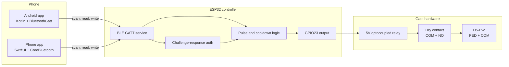
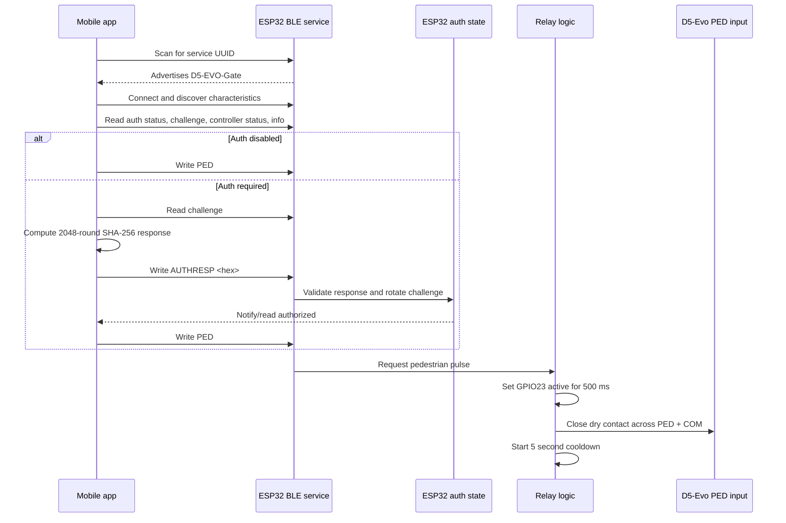
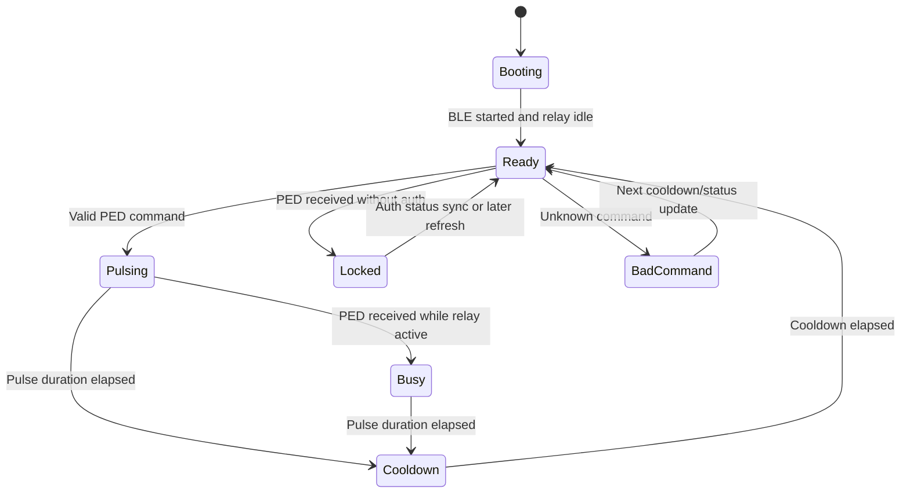
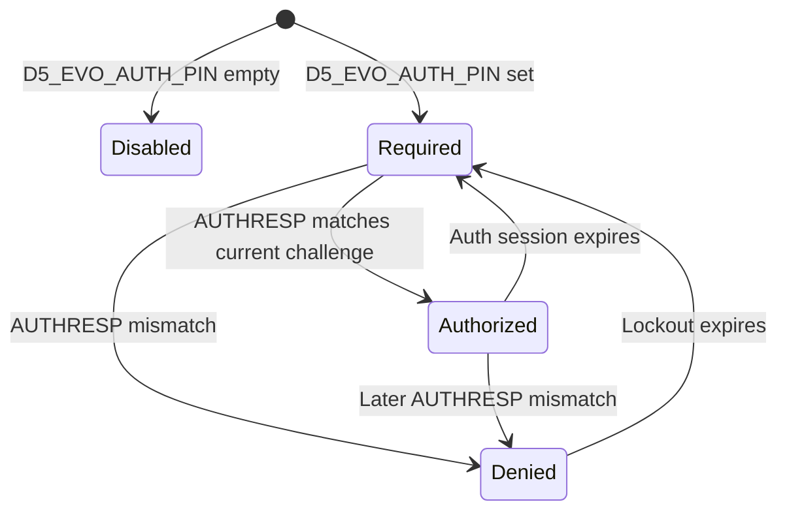
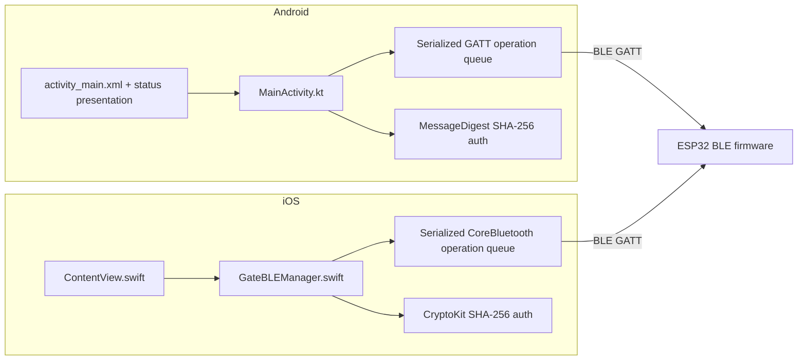

# Architecture

This document is the human architecture guide for the D5-Evo BLE Pedestrian
Trigger project. It describes what runs where, which component owns physical
behavior, and how the mobile apps authenticate before asking the ESP32 to pulse
the relay.

## System Context



The ESP32 firmware is the only component that touches physical control. Mobile
apps do not know relay timing, cooldown timing, or pin polarity. They connect
over BLE, read status, sign an auth challenge when needed, and write commands.
The default relay polarity is active-high on `GPIO23`; at idle, relay `COM` to
`NO` must be open.
The firmware also owns BLE connection recovery: if a client stays connected
without GATT reads or writes for the idle timeout, the ESP32 clears auth state
and disconnects that client so advertising can resume for another phone.

## Repository Architecture

```mermaid
flowchart TB
    Repo["d5-evo-gate"] --> Firmware["ESP32 firmware"]
    Repo --> Android["Android app"]
    Repo --> Ios["iPhone app"]
    Repo --> Docs["Docs and agent guides"]

    Firmware --> MainCpp["src/main.cpp"]
    Firmware --> AppConfig["include/app_config.h"]
    Firmware --> PlatformIO["platformio.ini"]

    Android --> MainActivity["MainActivity.kt"]
    Android --> AndroidManifest["AndroidManifest.xml"]
    Android --> AndroidResources["res/layout, values, drawable"]
    Android --> Gradle["Gradle Kotlin DSL"]

    Ios --> GateBLEManager["GateBLEManager.swift"]
    Ios --> ContentView["ContentView.swift"]
    Ios --> InfoPlist["Info.plist"]
    Ios --> XcodeProject["D5EvoBleGate.xcodeproj"]

    Docs --> Readme["README.md"]
    Docs --> Agents["AGENTS.md"]
    Docs --> Claude["CLAUDE.md"]
    Docs --> Architecture["docs/architecture.md"]
```



## BLE Surface

| Surface | UUID | Owner | Direction |
| --- | --- | --- | --- |
| Service | `4b8c2ec4-3f66-4f00-8a43-95f79d2c0cc1` | Firmware | Advertised by ESP32, scanned by apps. |
| Command | `4b8c2ec4-3f66-4f00-8a43-95f79d2c0cc2` | Firmware | Apps write `AUTHRESP <hex>` or `PED`. |
| Controller status | `4b8c2ec4-3f66-4f00-8a43-95f79d2c0cc3` | Firmware | Apps read/subscribe. |
| Auth challenge | `4b8c2ec4-3f66-4f00-8a43-95f79d2c0cc4` | Firmware | Apps read before signing. |
| Info | `4b8c2ec4-3f66-4f00-8a43-95f79d2c0cc5` | Firmware | Apps read user-facing guidance. |
| Auth status | `4b8c2ec4-3f66-4f00-8a43-95f79d2c0cc6` | Firmware | Apps read/subscribe. |

The default `D5_EVO_BLE_CLIENT_IDLE_TIMEOUT_MS` is `60000 ms`. Reads and writes
refresh the firmware-side client activity timer; notifications do not. Mobile
apps also disconnect when they leave the foreground so the firmware timeout is a
backup for killed, locked, or unreachable clients.

## Trigger Sequence



## Firmware State Model



Controller statuses are strings published over BLE:

- `ready`
- `pulsing`
- `cooldown`
- `busy`
- `locked`
- `bad-command`

The firmware loop advances relay and cooldown state every `10 ms`.

## Auth State Model



Auth rules:

- Empty `D5_EVO_AUTH_PIN` disables auth.
- Non-empty `D5_EVO_AUTH_PIN` requires challenge-response before `PED`.
- A successful auth session lasts `30000 ms` by default.
- A failed auth attempt starts a `15000 ms` lockout by default.
- The challenge rotates after every auth attempt and on BLE connect/disconnect.
- Idle BLE client timeout clears any active auth session before disconnecting the client.

## Auth Response Algorithm

The firmware, Android app, and iOS app must match this exactly:

```text
label = "D5-EVO-AUTH-V1|"
challenge = uppercase(challenge_from_characteristic)
digest = SHA256(label + pin + challenge)
repeat 2047 times:
    digest = SHA256(digest + pin + challenge)
response = uppercase_hex(digest)
command = "AUTHRESP " + response
```

The challenge is 16 random bytes encoded as 32 uppercase hex characters. The PIN
or passphrase is never written to BLE.

## Mobile App Architecture



Both mobile apps follow the same control contract:

1. Request the platform BLE permissions.
2. Scan by service UUID.
3. Connect to the nearby controller.
4. Discover the command, status, auth challenge, info, and auth status characteristics.
5. Refresh status in a serialized BLE operation queue.
6. If auth is required, sign the challenge locally.
7. Write `PED`.
8. Disconnect when the app leaves the foreground.

Android 12 and newer require `BLUETOOTH_SCAN` and `BLUETOOTH_CONNECT` for this
flow. Android 11 and older require `ACCESS_FINE_LOCATION` for BLE scanning. The
Android app guards direct BLE API calls and clears local BLE state if permission
is denied or revoked while the app is active.

## Build And Verification Matrix

| Area changed | Minimum command | Extra verification |
| --- | --- | --- |
| Firmware | `pio run -e esp32-usb-c-38pin` | Bench relay click test; supervised gate test before live use. |
| Android | `cd android-app && ./gradlew testDebugUnitTest --tests com.newhaven.gate.BlePermissionPolicyTest && ./gradlew assembleDebug` | Real Android BLE scan/connect/auth/trigger test. |
| iOS | `xcodebuild -project ios-app/D5EvoBleGate.xcodeproj -scheme D5EvoBleGate -sdk iphonesimulator -configuration Debug build` | Real iPhone BLE scan/connect/auth/trigger test. |
| Docs only | `rg` consistency checks | Confirm diagrams match code paths. |

## Safety Notes

- Build success does not prove safe wiring.
- BLE app success does not prove relay polarity is correct.
- Relay `COM` to `NO` must be open at idle and close only during the firmware pulse.
- The LM2596 must be adjusted to `5.0V` before powering ESP32 or relay.
- Relay output must remain momentary.
- Existing D5-Evo safety wiring must remain untouched.
