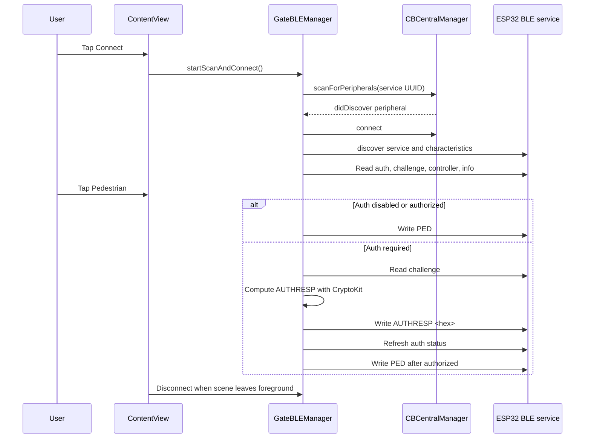

# iPhone App

Native iPhone client for the D5-Evo BLE Pedestrian Trigger. The app scans for
the ESP32's custom BLE service, connects with CoreBluetooth, reads controller
and auth state, signs the auth challenge with CryptoKit, and writes `PED`.

## Stack

- SwiftUI presentation
- `ObservableObject` BLE manager
- CoreBluetooth central/peripheral delegates
- CryptoKit SHA-256
- Xcode project targeting iOS 17

## Main Files

| Path | Purpose |
| --- | --- |
| `D5EvoBleGate/GateBLEManager.swift` | BLE scanning, connection, operation queue, auth signing, status state. |
| `D5EvoBleGate/ContentView.swift` | Single-screen SwiftUI gate control UI. |
| `D5EvoBleGate/D5EvoBleGateApp.swift` | App entry and environment object wiring. |
| `D5EvoBleGate/Info.plist` | Bundle metadata, Bluetooth usage text, local auth value injection. |
| `D5EvoBleGate/Config/Common.xcconfig` | Shared build config and optional local secrets include. |
| `D5EvoBleGate/Config/LocalSecrets.example.xcconfig` | Template for ignored local auth passphrase config. |

## BLE Flow



## Local Auth Setup

For local development builds that should auto-auth:

1. Copy `D5EvoBleGate/Config/LocalSecrets.example.xcconfig` to `D5EvoBleGate/Config/LocalSecrets.xcconfig`.
2. Set `D5EVO_AUTH_PIN` to the same passphrase used in firmware.
3. Keep `LocalSecrets.xcconfig` out of git.

If the local auth value is blank and firmware requires auth, the app will connect
and read status but will not trigger the gate.

## Build

Open `D5EvoBleGate.xcodeproj` in Xcode, select a development team for real-device
signing, and run on an iPhone for BLE testing.

Simulator compile check:

```bash
xcodebuild -project D5EvoBleGate.xcodeproj -scheme D5EvoBleGate -sdk iphonesimulator -configuration Debug build
```

## Agent Notes

- Keep BLE UUIDs in sync with `include/app_config.h` and Android.
- Keep auth hash rounds and label in sync with firmware and Android.
- CoreBluetooth behavior must be tested on a real iPhone; simulator builds only prove compilation.
- Keep `GateBLEManager` as the owner of BLE state and `ContentView` as presentation.
- Disconnect when the app scene leaves the foreground so a locked phone releases the gate.
- Do not add open/close gate controls unless the full firmware and documentation scope is deliberately expanded.
